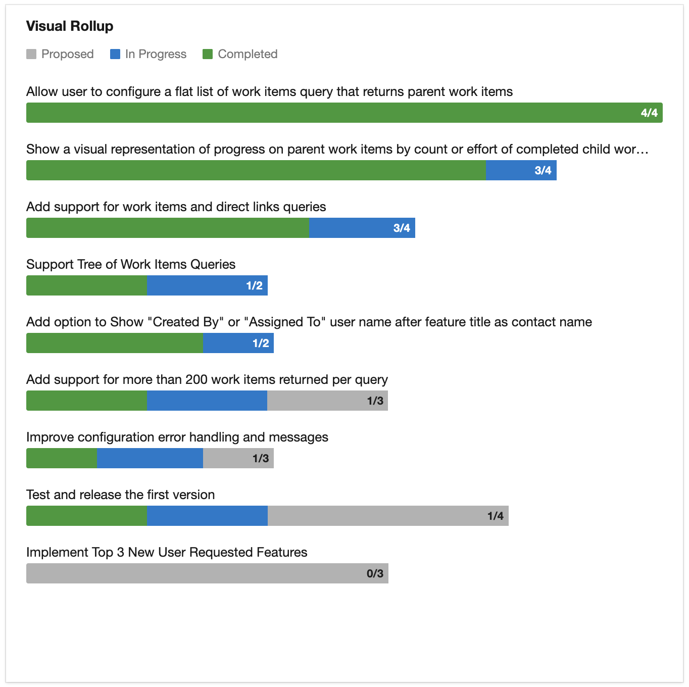
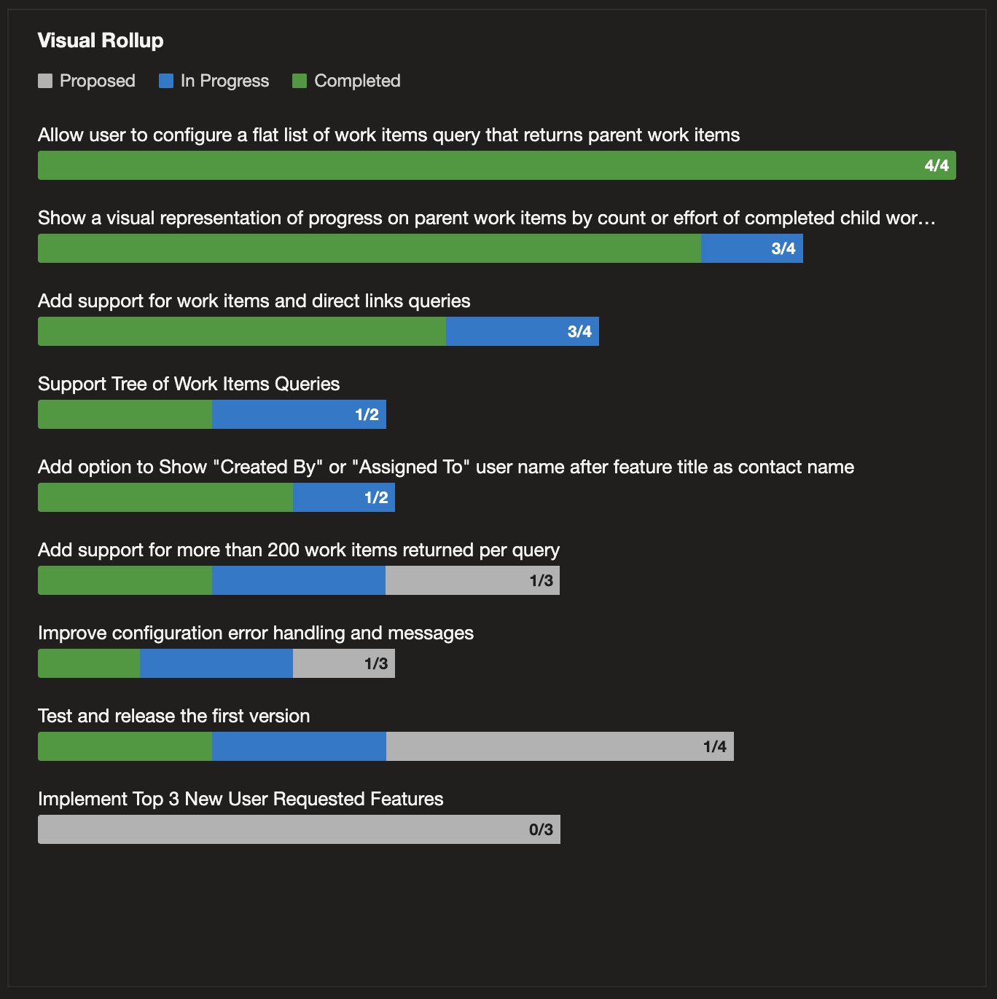

# Visual Rollup

Visual Rollup is an Azure DevOps dashboard widget that visualizes progress on parent work items based on the states, counts, and sizes of their child work items. Driven by a shared query you already have — full control over what shows up.

- **Any shared query** — flat lists, direct-link queries, or tree queries; you pick the work items, the widget rolls them up.
- **Tree query display level** — for hierarchical queries, choose which level becomes the parent row: Epics with Features rolling up, or Features with PBIs rolling up.
- **Sized by Effort, Story Points, or item count** — bars work whether your team estimates or not. Mixed-sized backlogs degrade gracefully to sized-sibling averages.
- **Custom process templates** — bar colors match the state colors configured by your template, not generic defaults. Any work item type your template defines is supported.
- **`done / total` label inside every bar** — see at-a-glance how many children are completed without hovering or clicking.
- **Theme-aware** — light and dark modes track your Azure DevOps theme; no per-widget setting needed.

Created by **AgileViz**. The plugins each do one thing well — simplicity is a feature, not an oversight.

### Documentation and support
Full documentation, configuration guide, and support: [AgileViz.com/plugins/visual-rollup/](https://AgileViz.com/plugins/visual-rollup/)
